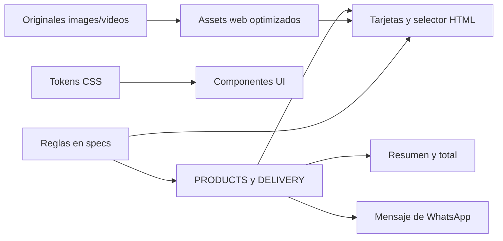

# Arquitectura técnica

Estado: **Vigente**.

## Stack y límites

- HTML5 semántico.
- CSS mobile-first sin preprocesador.
- JavaScript nativo, cargado con `defer`.
- Hosting estático en GitHub Pages.
- Google Fonts es la única dependencia web de presentación.
- WhatsApp e Instagram son las únicas integraciones externas visibles.
- No hay build, package manager, framework, API, base de datos, service worker, analítica ni almacenamiento local.

La ausencia de build es una decisión del MVP. No migrar a React, Astro, Vue, un CMS o un sistema de ecommerce porque una edición aislada resulte más cómoda. Evaluar esas migraciones con los criterios de [growth-roadmap.md](growth-roadmap.md) y registrar la decisión en un ADR.

## Mapa de archivos

```text
.
├── AGENTS.md                    Entrada para agentes
├── CNAME                       Dominio de GitHub Pages del entorno actual
├── README.md                   Inicio rápido para humanos
├── index.html                  Estructura, contenido y referencias
├── assets/
│   ├── styles.css              Tokens, componentes y responsive
│   ├── site.js                 Interacciones, catálogo y pedidos
│   ├── proceso-pedido.svg      Flyer editable
│   ├── cb-logo-new-v1.webp     Logo web transparente
│   ├── favicon.png             Icono derivado del logo
│   ├── video-poster.jpg        Poster del video
│   └── *.webp                  Fotos optimizadas usadas por el sitio
├── images/                     Fuentes originales y recursos no publicados
├── videos/                     Videos promocionales originales
├── specs/                      Contratos y decisiones del proyecto
└── .agents/skills/             Flujos reutilizables para agentes
```

## Convenciones HTML

- Idioma del documento: `es-UY`.
- IDs estables de secciones: `hero`, `experiencia`, `sabores`, `nosotros`, `pedido`.
- La compatibilidad del enlace histórico `#menu` redirige a `#sabores` en `assets/site.js`.
- Usar elementos semánticos: `header`, `nav`, `main`, `section`, `article`, `figure`, `form`, `fieldset`, `footer`, `dialog`.
- Mantener dimensiones `width` y `height` en imágenes para reducir saltos de layout.
- Imágenes bajo el primer viewport usan `loading="lazy"`; logo y contenido inicial no.
- Enlaces externos en pestaña nueva usan `rel="noopener"`.
- Los controles tienen nombre accesible; el texto decorativo usa `aria-hidden="true"`.

## Convenciones CSS

- Los colores de marca y aliases semánticos viven en `:root`.
- Empezar por móvil y ampliar con los breakpoints existentes: 540, 768 y 1100 px. El ajuste de pantallas extremadamente angostas vive en `max-width: 359px`.
- No introducir valores de marca hexadecimales nuevos si existe un token apropiado.
- Mantener `prefers-reduced-motion: reduce`.
- Preferir layout con Grid/Flex y tamaños fluidos; no fijar alturas para contenido textual.
- El contenido debe funcionar a 200% de zoom y desde 320 px sin desplazamiento horizontal.
- La clase `.sr-only` es la utilidad de texto para tecnologías de asistencia.

## Convenciones JavaScript

- Mantener `"use strict"`, `const` por defecto y funciones pequeñas con nombres descriptivos.
- No usar dependencias, módulos remotos ni código insertado desde terceros.
- `PRODUCTS`, `DELIVERY` y `WHATSAPP_NUMBER` son la definición ejecutable del pedido.
- El sitio debe seguir mostrando todo el contenido comercial si JavaScript falla. Solo las interacciones avanzadas y el armado del mensaje dependen de JS.
- Los controles del carrusel se revelan por JS; sin JS, el primer sixpack sigue visible.
- No usar `innerHTML` con contenido del usuario. El mensaje de WhatsApp se construye como texto y se codifica con `encodeURIComponent`.
- No enviar datos automáticamente ni simular un éxito antes de que la persona complete la conversación por WhatsApp.

## Dependencias entre componentes



## Cambios futuros

Antes de incorporar una dependencia, responder en el ADR:

1. ¿Qué problema de negocio resuelve?
2. ¿Por qué el stack estático ya no alcanza?
3. ¿Quién mantendrá actualizaciones, seguridad y costos?
4. ¿Cómo se preservarán URLs, SEO, accesibilidad y pedidos existentes?
5. ¿Cuál es el plan de reversión?
